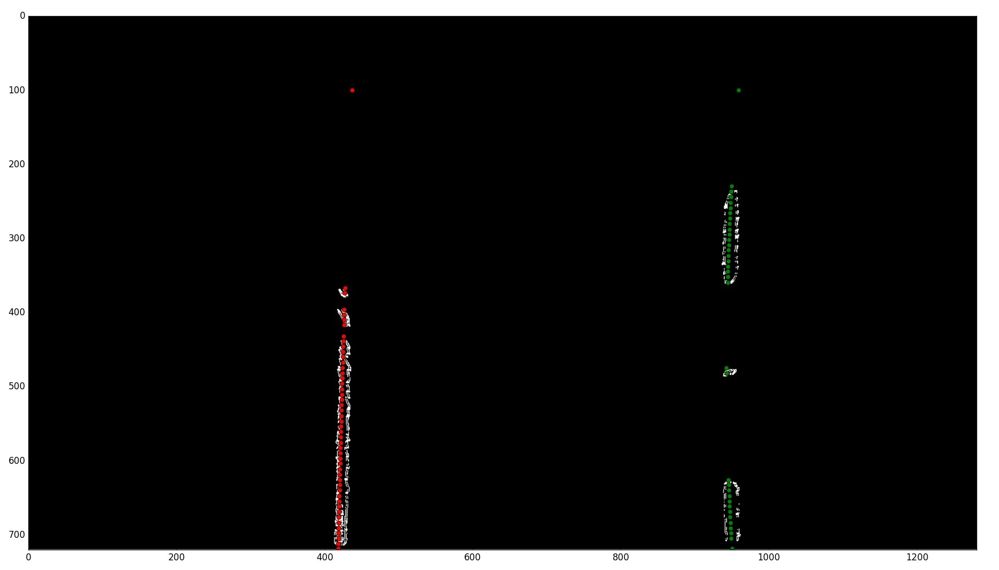
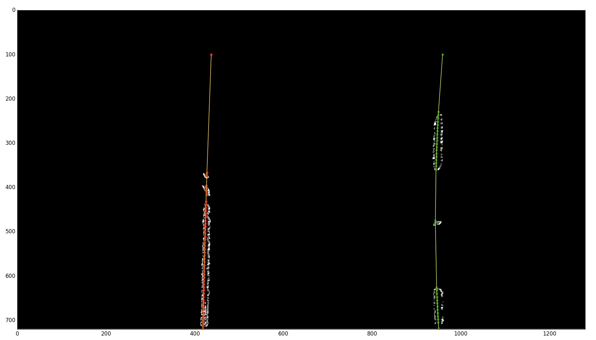
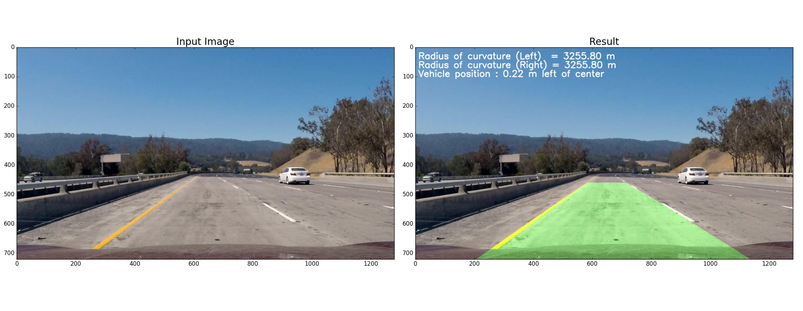

## Advanced Lane Finding
[](http://www.udacity.com/drive)

The Project
---

The goals / steps of this project are the following:

* Compute the camera calibration matrix and distortion coefficients given a set of chessboard images.
* Apply a distortion correction to raw images.
* Use color transforms, gradients, etc., to create a thresholded binary image.
* Apply a perspective transform to rectify binary image ("birds-eye view").
* Detect lane pixels and fit to find the lane boundary.
* Determine the curvature of the lane and vehicle position with respect to center.
* Warp the detected lane boundaries back onto the original image.
* Output visual display of the lane boundaries and numerical estimation of lane curvature and vehicle position.

The images for camera calibration are stored in the folder called `camera_cal`.  The images in `test_images` are for testing your pipeline on single frames.  To help the reviewer examine your work, please save examples of the output from each stage of your pipeline in the folder called `ouput_images`, and include a description in your writeup for the project of what each image shows.    The video called `project_video.mp4` is the video your pipeline should work well on.  

The `challenge_video.mp4` video is an extra (and optional) challenge for you if you want to test your pipeline under somewhat trickier conditions.  The `harder_challenge.mp4` video is another optional challenge and is brutal!

If you're feeling ambitious (again, totally optional though), don't stop there!  We encourage you to go out and take video of your own, calibrate your camera and show us how you would implement this project from scratch!

### Camera Calibration

#### 1. Briefly state how you computed the camera matrix and distortion coefficients. Provide an example of a distortion corrected calibration image.

The code for this step is contained in the seperate python file named `CameraCalibration.py`

1. Converting an image, imported by cv2 or the glob API, to grayscale:
``` gray = cv2.cvtColor(img,cv2.COLOR_BGR2GRAY) ```

2. Finding chessboard corners (for an 8x6 board):
Assuming that the chessboard is fixed on the (x, y) plane at z=0, such that the object points are the same for each calibration image. Thus, objp is just a replicated array of coordinates, and objpoints will be appended with a copy of it every time when chessboard corners are detected successfullyin a test image. imgpoints will be appended with the (x, y) pixel position of each of the corners in the image plane with each successful chessboard detection. The following code returns the image corners using Opencv functionality
```ret, corners = cv2.findChessboardCorners(gray, (9,6),None)```

3. Drawing detected corners on an image:
```img = cv2.drawChessboardCorners(img, (9,6), corners, ret)```
4. Use the output objpoints and imgpoints to compute the camera calibration and distortion coefficients using the cv2.calibrateCamera() function
```ret, mtx, dist, rvecs, tvecs = cv2.calibrateCamera(objpoints, imgpoints, gray.shape[::-1],None,None)```

5. Apply distortion correction to the test image using the cv2.undistort() function.
```dst = cv2.undistort(img, mtx, dist, None, mtx)```

The sample undistorted input image is shown below


### Pipeline (single images)

#### 1. Provide an example of a distortion-corrected image.
To demonstrate this step, the distortion correction is applied to one of the test images and output is shown below.


#### 2. Describe how (and identify where in your code) you used color transforms, gradients or other methods to create a thresholded binary image.  Provide an example of a binary image result.
First step in detecting the lane lines is to eliminated unnecessary image content from the image which might not be lanes. In order to acheive this various combination of color information is used. Rather than targeting all the lanes at one go, seperate functionality was used to detect white and yellow lanes seperately. In this way, the architecture can be easily changed, if any other lane with different color like blue needs to be detected. The pipeline also include condition checking, where the image is classified as normal, dark or bright. This is done to enhance the image if it found to be either bright or dark. In this module when using sobel and gradient based detection, almost all the edge condition where captures like shadow and visible road split etc. The information was bit tedious to filter llter. So this setup was used as the back-up to find edges, if the image is either dark or brighter. For normal images, color based detection were used. After experimenting different color space like RGB, HSL, HSV, YCbCr and LAB was found to be useful in detecting both white and yellow lane.
The implementation of this module can be seen in the file `LaneDection.py`. The function `extract_lane_information()` was used in normal condition where as function `extract_lane_information_diff_condition()` was used in non-normal cases. The pipeline explained is shown below.
Overall Pipeline:

Normal Condtion Processing:

Non-normal Conditioni Processing:


The sample threshold binary images are shown below.


#### 3. Describe how (and identify where in your code) you performed a perspective transform and provide an example of a transformed image.

The code for perspective transform in`PrespectiveTransform.py` includes a function called `warp_image()`. The `warp_image()` function takes as inputs an image (`img`), as well as source (`src_points`) and destination (`dst_points`) points and warps the image. The hardcode the source and destination points are choosen as follows:
```
src_points = np.float32([[240, 720],
                        [575, 460],
                        [715, 460],
                        [1150, 720]])
dst_points = np.float32([[440, 720],
                        [440, 0],
                        [950, 0],
                        [950, 720]])
```
In order to check the correctness of the perspective transform, the `src_points` and `dst_points` points were drawn onto a test image and its warped image is verified to see if the lines appear parallel in the warped image.


#### 4. Describe how (and identify where in your code) you identified lane-line pixels and fit their positions with a polynomial?

Once the thresholded binary image is calculated, next step is to identify the exact lane points. In order to identify location of the lanes, image `histogram` is used. The image is first splitted into two region. One for left lane and one for right lane. Then small windows of size is move from bottom to top on left and right image seperately. Based on max histogram out, pixel location is calculated. The pixel location across the windows are saved in an array and then `polyfit` is used to fit the pixel locations. This is implemented in `extract_lane_coordinates()`. This procedure of searching entire image is done for fixed number of frames given by variable `frames_confidence` Once the detection confidence is reached, then rather than searching entire image region, a small region around the detected line is used for finding the pixel location `get_restricted_search()`. The code implementation of this module can be seen in the file `LaneInformation.py`. The following image demostrates this functionality. 
GrayImage:

LanePoints:

LaneFitting:

Restricted Search Area (Within blue region):


#### 5. Describe how (and identify where in your code) you calculated the radius of curvature of the lane and the position of the vehicle with respect to center.
The radius of curvature (awesome tutorial here) at any point x of the function x=f(y) is given as follows:

In the case of the second order polynomial above, the first and second derivatives are:

So, our equation for radius of curvature becomes:

The y values of your image increase from top to bottom, so if, for example, you wanted to measure the radius of curvature closest to your vehicle, you could evaluate the formula above at the y value corresponding to the bottom of your image, or in Python, at yvalue = image.shape[0].

We've calculated the radius of curvature based on pixel values, so the radius we are reporting is in pixel space, which is not the same as real world space. So we actually need to repeat this calculation after converting our x and y values to real world space.

This involves measuring how long and wide the section of lane is that we're projecting in our warped image. We could do this in detail by measuring out the physical lane in the field of view of the camera, but for this project, it is assumed that the lane is about 30 meters long and 3.7 meters wide. The code implementing this radius of curvature can be seen in the funtion named `get_curvature_radius()` in file `LaneInformation.py`

The position of the vehicle is identified by taking a point on the left and right lane respectively and center point of the lane is calculated. The center of the image in pixel is 640. The difference between lane and pixel center is then multiplied by meteres per pixel in x dimension (3.7/700) to obtain vehicle position off the center. This can be seen in this function implementation `vehicle_position()` in `Advanced-Lane-Finding.ipynb`

#### 6. Provide an example image of your result plotted back down onto the road such that the lane area is identified clearly.

For display an image with lane area overlaid, the function named `overlay_lane` is used which can be found in the notebook `AdvanceLaneFinding.ipynb` in the cell number #10. The sample output after the overlay is shown below.



---

### Pipeline (video)

#### 1. Provide a link to your final video output.  Your pipeline should perform reasonably well on the entire project video (wobbly lines are ok but no catastrophic failures that would cause the car to drive off the road!).

Here's a [link to my video result](https://youtu.be/YpBxMBdqF-I)

---

### Discussion

#### 1. Briefly discuss any problems / issues you faced in your implementation of this project.  Where will your pipeline likely fail?  What could you do to make it more robust?

Bit effort was needed to find proper threshold values for extracting only useful information. The pipeline fails, if there is change in image intensity like too dark or too bright images. Especially in harder_challenge_video, this pipeline would fail. In order to make it robust, general road detection has to be done and then further preprocessing of the selected road region would help in detecting too bright and dark images. Also, better tracking method should be used to track result from previous frame. As indicated in the lecture, different sanity checking like lane curvature similarity and lane parallelism can be used effectively to mitigate wrong detection.
