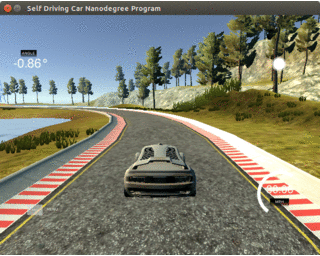

# Behavioral Cloning

This is one of the projects in [Udacity Self Driving Car NanoDegree Course](https://www.udacity.com/course/self-driving-car-engineer-nanodegree--nd013). The project uses a simulator build by Udacity to train and test autonomous driving of the car around the circuit using Deep Learning technique. The goal of the project is too predict the steering angle of the car, given images. It is similar to the [challenge #2](https://medium.com/udacity/challenge-2-using-deep-learning-to-predict-steering-angles-f42004a36ff3#.b3l2j4uho) organized by Udacity. Rather than using real world recording, this project uses a simulator to record the data and then later train them using [Keras Deep Learning framework](https://keras.io/). This project was inspired by the work done by Nvidia. You may watch [this incredible video](https://devblogs.nvidia.com/parallelforall/deep-learning-self-driving-cars/) from Nvidia which highlights their efforts of teaching a car how to drive using only cameras and deep learning. Their DAVE-2 deep learning system is capable of driving in many different weather conditions, avoiding obstacles, and even going off-road!

The following animation shows the output of this projects.
Track 1                       |  Track 2                      |
:----------------------------:|:------------------------------:
 |  |

## Requirements:
### Simulator:
A simulator based on the Unity engine that uses real game physics to create a close approximation to real driving. The simulator looks likes follows

##### Training Mode
In order to start collecting training data, you'll need to do the following:
 - Enter Training Mode in the simulator.
 - Start driving the car to get a feel for the controls.
 - When you are ready, hit the record button in the top right to start recording.
 - Continue driving for a few laps or till you feel like you have enough data.
 - Hit the record button in the top right again to stop recording.

If everything went correctly, you should see the following in the directory you selected:
 - IMG folder - this folder contains all the frames of your driving.
 - driving_log.csv - each row in this sheet correlates your image with the steering angle, throttle, brake, and speed of your car. You'll mainly be using the steering angle.

##### Training Your Network
Now that you have training data, it’s time to build and train your network!
Use Keras to train a network to do the following:
 - Take in an image from the center camera of the car. This is the input to your neural network.
 - Output a new steering angle for the car.
You don’t have to worry about the throttle for this project, that will be set for you

### Software:
 - [NumPy](http://www.numpy.org/)
 - [Keras](https://keras.io/)
 - [flask-socketio](https://flask-socketio.readthedocs.io/en/latest/)
 - [eventlet](http://eventlet.net/)
 - [pillow](https://python-pillow.org/)
 - [h5py](http://www.h5py.org/)
 
## Project Description
The following list contains description of the files available in this github repo.
 - model.py - The script used to create and train the model.
 - drive.py - The script to drive the car.
 - model.json - The model architecture.
 - model.h5 - The model weights. (See below for the download link)
 - utils.py - The script used to read and generate augmented data
 - sample - Folder containing images used for explanation
 - viz.py - The script to save the model architecture as a image
 - helper.ipynb - The script to analyze and save data augmentations
 
 ### Data
The data from the simulator has three images captured using left, center and right camera. Sample images from the simulator are shown below. 

Left Image                    |  Center Image                  |  Right Image                   |
:----------------------------:|:------------------------------:|:------------------------------:|
      |    |      | 

Apart from capturing these data while driving around the circuit, there is a need to record recovery data. If you drive and record normal laps around the track, even if you record a lot of them, it might not be enough to train your model to drive properly.

Here’s the problem: if your training data is all focused on driving down the middle of the road, your model won’t ever learn what to do if it gets off to the side of the road. And probably when you run your model to predict steering angles, things won’t go perfectly and the car will wander off to the side of the road.

So we need to teach the car what to do when it’s off on the side of the road. In general, it is probably enough to drive a couple of laps of nice, centerline driving, and then add one lap weaving out to the right and recovering, and another lap weaving out to the left and recovering. A sample recover image from the center camera is shown below.

Recovery 1                        |  Recovery 2                       |  Recovery 3                       |
:--------------------------------:|:---------------------------------:|:---------------------------------:|
| | |

As mentioned above, data augmentation plays a major role in making the model to predict angles across different location of the car in the circuit. To achieve this, we used the following.
 - Use left, right and center image
 - Since the track has more left turn than right ones, in order to generalize well, random image flipping for center images is used 

Since similator outputs steering angle corresponding to the center images, in order to use the left and right images, we need to predict steering angle from the available center steering angle. Since the camera geometry and locations are not known, from which actual angle can be calculated, we use random fixed constant value for left and right camera. For the experiment conducted, we found that value in range of [0.8 to 2.0] seems to work fine. Here in my model, I have used a constant value of 0.2. In case of center horizontal flip images, the steering angle is multiplied by (-1). The following table shows the details of the images used in training.

 Name                   | Number Images  | Description                                                               
:-----------------------|---------------:|:--------------------------------------------------------------------------
 track1_central         |  14,435        | driving along the center of the track                                  
 track1_recovery        |  9,821         | driving from the side of the road back to the center                      
 track1_turn            |  7,760         | record driving only during the turns           
 **total**              | **32,016**     | Total includes left, right and center images                               
For validation instead of splitting training data, test data driving was recorded to give better insight of autonomous driving condition.

 Name                   | Number Images  | Description                                                               
:-----------------------|---------------:|:--------------------------------------------------------------------------
 track1_test            |  21,392        | driving centered on the road for one round on track 1                     
 **total**              | **21,392**     | Total includes left, right and center images
 
Note: All these data was recorded with 50Hz simulator using keyboard controller

### Architecture

Since this project tries to replicate the [Nvidia End to End learning](https://arxiv.org/abs/1604.07316), the model presented in the paper was initially used. But, the model does not generalize well with limited number of training images. In order to make the model work, more extra images were recorded based specific location where the car ran out of track. Even though the model was able to manuveur across the circuit, the prediction was not smooth, with car slight wandering some time in the middle, which did not look visually pleasing. Based on the assumption that the model parameters were not enough, bigger model with more layers and parameters was chosen. VGG16 was considered as the base and then extended to solve this regression steering angle prediction. Even this gave an oppurtunity to test transfer learning too. The following figure shows the architecture visualization of the model used. Here, the model from layers block5 are trained, while keeping others frozen.

### Training
With the collected data as explained in data section, the model was trained using Keras with tensorflow backend. Initially, data was pickled for training. But later when more images were added, the process became inefficient due to lack of memory. So, [keras generator](https://github.com/fchollet/keras/blob/master/keras/preprocessing/image.py) was used. Especially _flow_from_directory_ was modified and used to load the images and angle from the disk on the go while training. After few epoch of training, the model was able to navigate across the track 1 with ease. But when the same model was tested against track 2, the model did not generalize well and failed. In order to address this problem of generalization, data augmentation was used. The following are the list of few technique used for augmentation.
- Flip
- Rotation
- Shift
- Brightness Correction using gamma
- Channel intensity shift variation (CVShift)

Input                  |  Rotated                |  Shifted                | Flip                   | 
:---------------------:|:-----------------------:|:-----------------------:|:----------------------:|
|   | | |

Gamma [0.5]            |  Gamma [2]              |  CVShift [10]          | 
:---------------------:|:-----------------------:|:----------------------:|
| |   |

After training with data augmentation, the model generalized well and was able to drive around track 2 without training on track 2 images. Please note that model failed to complete track2 due to a one tight bending. Neverthless, since the process is known now, with more data augmentation, this can be overcomed. Due to lack of time, this is currently done.

In order to check whether the model works for all the data independent of who is recording, training was once carried out using Udacity provided data. As expected, the model was able drive in track1 without any modification.

### Model:
Since the files are huge, the model can be downloaded from the following link
 - [model.h5](https://drive.google.com/open?id=0B0CHhxRP_jmINVlva1gyVHlEUmM)
 
## Reference
1. [Creating readme Markdown](https://en.support.wordpress.com/markdown-quick-reference/)
2. [Keras Model Visualization](https://keras.io/visualization/)
3. [Keras Generator](https://github.com/fchollet/keras/blob/master/keras/preprocessing/image.py)
4. [VGG Usage](https://blog.keras.io/building-powerful-image-classification-models-using-very-little-data.html)
4. Slack channel used in SDCND (#p-behavioral-cloning)

## Future Work 
Similar to predicting angles, throttle can also be predicted to navigate the car.

## Acknowledgement
I would like to thank all the people in slack community especially Patrick Kern, John Chen, Paul Herath and many more who gave their valuable suggestions in completed this project successfully.
